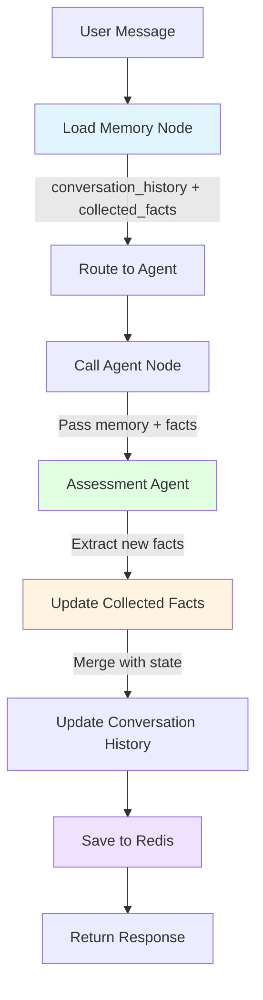

# V31.4: Clean Orchestration with Memory and State Management

**Date:** 2025-11-04
**Version:** v31.4
**Focus:** Implement gold standard architecture with proper memory, state, and observability

---

## Gap Analysis Against Gold Standard

Based on **V30_PLATFORM_VS_INDUSTRY_GOLD_STANDARD_GAP_ANALYSIS.md**, we're missing:

### 🔴 Critical Missing Components

1. **Memory/Conversation State** - No persistent memory across turns
2. **Checkpointing** - No ability to pause/resume workflows
3. **Event-Driven Architecture** - Synchronous blocking calls
4. **Distributed Tracing** - Basic console.log only
5. **Fault Tolerance** - No retries, timeouts, or circuit breakers

### ✅ Our Advantages (Keep These!)

1. **83 Intelligence Types** - Domain-specific reasoning
2. **FactStore** - SQL-backed, zero-hallucination facts
3. **Knowledge Base** - 93 weeks of expert coaching

---

## Clean Architecture Design (Gold Standard)

```
┌─────────────────────────────────────────────────────────────┐
│                    REQUEST (Frontend)                       │
└───────────────────────────┬─────────────────────────────────┘
                            │
                            ▼
┌─────────────────────────────────────────────────────────────┐
│  Route Handler (v26-multiagents.ts)                        │
│  - Parse request                                             │
│  - Map real → clone student                                  │
│  - Save user message                                         │
└───────────────────────────┬─────────────────────────────────┘
                            │
                            ▼
┌─────────────────────────────────────────────────────────────┐
│  LangGraph Orchestrator (WITH MEMORY & CHECKPOINTING)      │
│                                                              │
│  ┌────────────────────────────────────────────────────┐   │
│  │  WorkflowState (managed by LangGraph)              │   │
│  │  - student_id                                      │   │
│  │  - session_id                                      │   │
│  │  - conversation_history []  ← MEMORY               │   │
│  │  - collected_facts {}        ← CUMULATIVE STATE    │   │
│  │  - current_phase             ← PHASE TRACKING      │   │
│  │  - agent_outputs []          ← AGENT RESULTS       │   │
│  └────────────────────────────────────────────────────┘   │
│                                                              │
│  ┌────────────────────────────────────────────────────┐   │
│  │  Redis Checkpointer (state persistence)            │   │
│  │  - Auto-save state after each node                 │   │
│  │  - Enable pause/resume                              │   │
│  │  - Horizontal scaling support                       │   │
│  └────────────────────────────────────────────────────┘   │
│                                                              │
│  ┌────────────────────────────────────────────────────┐   │
│  │  StateGraph Workflow                                │   │
│  │                                                      │   │
│  │  [start] → [load_memory] → [call_agent]            │   │
│  │              ↓                   ↓                   │   │
│  │         [update_facts]      [save_metadata]         │   │
│  │              ↓                   ↓                   │   │
│  │         [checkpoint] ←──────────┘                   │   │
│  │              ↓                                       │   │
│  │           [return]                                   │   │
│  └────────────────────────────────────────────────────┘   │
└───────────────────────────┬─────────────────────────────────┘
                            │
                            ▼
┌─────────────────────────────────────────────────────────────┐
│  Agent (wrapped as LangGraph tool)                          │
│  - Assessment Agent (TYPE-080)                              │
│  - GamePlan Agent (TYPE-081)                                │
│  - Execution Agent                                          │
│  - Etc.                                                      │
│                                                              │
│  Input:                                                      │
│  - conversation_history (from memory)                       │
│  - collected_facts (cumulative state)                       │
│  - current message                                          │
│                                                              │
│  Output:                                                     │
│  - response                                                  │
│  - metadata { data_collected_so_far }  ← PRESERVED         │
│  - intelligence_triggered []                                │
└─────────────────────────────────────────────────────────────┘
```

---

## Key Components

### 1. Memory Management (Conversation History)

**Problem:** Currently, conversation history is loaded ad-hoc per agent call. No centralized memory.

**Solution:** LangGraph manages conversation history as part of state.

```typescript
// File: src/langgraph/state.ts

export interface ConversationMessage {
  role: 'user' | 'agent' | 'system';
  content: string;
  timestamp: Date;
  agent_id?: string;
  metadata?: Record<string, any>;
}

export interface WorkflowState {
  // Identity
  student_id: string;
  session_id: string;

  // 🆕 MEMORY - Conversation history (persisted)
  conversation_history: ConversationMessage[];

  // 🆕 CUMULATIVE STATE - Facts collected across turns
  collected_facts: Record<string, any>;

  // Phase tracking
  current_phase: 'assessment' | 'gameplan' | 'execution';
  current_agent: string;

  // Agent outputs
  agent_response: string;
  agent_metadata?: Record<string, any>;
  confidence?: number;
  intelligence_triggered?: string[];

  // Error handling
  error?: string;
  retry_count?: number;
}
```

**Benefits:**
- ✅ Conversation history automatically preserved across turns
- ✅ Agents receive full context without manual loading
- ✅ State persisted in Redis (survives restarts)
- ✅ Can replay conversations for debugging

---

### 2. Checkpointing (State Persistence)

**Problem:** No ability to pause/resume workflows. No horizontal scaling.

**Solution:** Redis-backed checkpointing.

```typescript
// File: src/langgraph/LangGraphOrchestrator.ts

import { RedisSaver } from "@langchain/langgraph-checkpoint-redis";
import Redis from "ioredis";

export class LangGraphOrchestrator {
  private checkpointer: RedisSaver;

  constructor(pool: Pool, factStore: FactStore, redisUrl: string) {
    // 🆕 Redis checkpointer for state persistence
    const redis = new Redis(redisUrl);
    this.checkpointer = new RedisSaver(redis);

    // Build workflow with checkpointing
    this.buildWorkflow();
  }

  private buildWorkflow() {
    const workflow = new StateGraph<WorkflowState>({
      channels: {
        // Define how state updates are merged
        conversation_history: {
          value: (prev: ConversationMessage[], next: ConversationMessage[]) => {
            // Append new messages to history
            return [...prev, ...next];
          },
          default: () => []
        },
        collected_facts: {
          value: (prev: Record<string, any>, next: Record<string, any>) => {
            // Merge new facts with existing
            return { ...prev, ...next };
          },
          default: () => ({})
        }
      }
    });

    // Define nodes (see below)
    this.defineWorkflowNodes(workflow);

    // 🆕 Compile with checkpointer
    this.app = workflow.compile({
      checkpointer: this.checkpointer
    });
  }

  async handleMessage(request: {
    student_id: string;
    session_id: string;
    message: string;
  }) {
    // 🆕 Execute with checkpointing config
    const config = {
      configurable: {
        thread_id: request.session_id,  // Use session as thread
        checkpoint_ns: "production"
      }
    };

    // State automatically saved after each node
    const result = await this.app.invoke({
      student_id: request.student_id,
      session_id: request.session_id,
      conversation_history: [{
        role: 'user',
        content: request.message,
        timestamp: new Date()
      }],
      // Previous state automatically loaded from Redis
    }, config);

    return result;
  }
}
```

**Benefits:**
- ✅ State persisted after each node execution
- ✅ Can pause/resume workflows
- ✅ Horizontal scaling (multiple instances share Redis)
- ✅ Automatic recovery from crashes

---

### 3. Memory Loading Node

**Problem:** Agents manually load conversation history from DB.

**Solution:** Dedicated node loads memory before agent call.

```typescript
// Add to workflow definition

workflow.addNode("load_memory", async (state: WorkflowState) => {
  log.event('memory.loading', {
    session_id: state.session_id,
    history_length: state.conversation_history.length
  });

  // Load conversation history from database (if not in state yet)
  if (state.conversation_history.length === 0) {
    const messages = await pool.query(`
      SELECT role, content, timestamp, agent_id, metadata
      FROM multiagent_messages
      WHERE session_id = $1
      ORDER BY timestamp ASC
    `, [state.session_id]);

    state.conversation_history = messages.rows.map(row => ({
      role: row.role,
      content: row.content,
      timestamp: row.timestamp,
      agent_id: row.agent_id,
      metadata: row.metadata
    }));
  }

  // Load collected facts from previous turns
  if (Object.keys(state.collected_facts || {}).length === 0) {
    const facts = await pool.query(`
      SELECT edges FROM kb_items
      WHERE student_id = $1 AND source_ref = 'gpt4o_conversational_extraction_v28'
    `, [state.student_id]);

    // Merge all collected facts
    state.collected_facts = facts.rows.reduce((acc, row) => {
      return { ...acc, ...row.edges };
    }, {});
  }

  log.event('memory.loaded', {
    session_id: state.session_id,
    messages_count: state.conversation_history.length,
    facts_count: Object.keys(state.collected_facts).length
  });

  return {
    conversation_history: state.conversation_history,
    collected_facts: state.collected_facts
  };
});
```

**Benefits:**
- ✅ Centralized memory loading
- ✅ Memory available to all agents
- ✅ Easy to debug (single loading point)

---

### 4. Agent Call with Memory

**Problem:** Agents don't receive collected facts from previous turns.

**Solution:** Pass memory and collected facts to agent.

```typescript
workflow.addNode("call_agent", async (state: WorkflowState) => {
  const tool = this.tools.get(state.current_agent);

  if (!tool) {
    return { error: `Agent not found: ${state.current_agent}` };
  }

  log.event('agent.calling', {
    agent: state.current_agent,
    memory_messages: state.conversation_history.length,
    collected_facts_keys: Object.keys(state.collected_facts || {})
  });

  // 🆕 Call agent with memory and collected facts
  const result = await tool.func({
    student_id: state.student_id,
    session_id: state.session_id,
    message: state.conversation_history[state.conversation_history.length - 1].content,

    // 🆕 PASS MEMORY
    conversation_history: state.conversation_history,

    // 🆕 PASS COLLECTED FACTS
    collected_facts: state.collected_facts
  });

  const parsed = parseAgentToolResult(result as string);

  // 🆕 Extract new facts from agent metadata
  const newFacts = parsed.metadata?.data_collected_so_far || {};

  log.event('agent.completed', {
    agent: state.current_agent,
    new_facts_count: Object.keys(newFacts).length,
    intelligence_count: parsed.intelligence_triggered?.length || 0
  });

  // 🆕 Update conversation history with agent response
  const agentMessage: ConversationMessage = {
    role: 'agent',
    content: parsed.response || '',
    timestamp: new Date(),
    agent_id: state.current_agent,
    metadata: parsed.metadata
  };

  return {
    agent_response: parsed.response,
    agent_metadata: parsed.metadata,
    confidence: parsed.confidence,
    intelligence_triggered: parsed.intelligence_triggered,

    // 🆕 Append to history
    conversation_history: [agentMessage],

    // 🆕 Merge new facts
    collected_facts: newFacts
  };
});
```

**Benefits:**
- ✅ Agents receive full conversation context
- ✅ Agents see previously collected facts
- ✅ No infinite loop (agent sees what was collected)

---

### 5. Update Agent Tool Wrapper Schema

**Problem:** Current AgentToolWrapper doesn't accept memory/facts.

**Solution:** Update schema to accept memory.

```typescript
// File: src/langgraph/AgentToolWrapper.ts

export const AgentToolInputSchema = z.object({
  student_id: z.string().describe("Student ID"),
  session_id: z.string().describe("Session ID"),
  message: z.string().describe("Current user message"),
  is_a2a_handover: z.boolean().optional().default(false),

  // 🆕 MEMORY FIELDS
  conversation_history: z.array(z.object({
    role: z.enum(['user', 'agent', 'system']),
    content: z.string(),
    timestamp: z.date(),
    agent_id: z.string().optional(),
    metadata: z.record(z.any()).optional()
  })).optional().describe("Conversation history"),

  collected_facts: z.record(z.any()).optional().describe("Previously collected facts")
});

export function wrapAgentAsTool(
  agent: BaseAgentWithIntelligence,
  agentId: string,
  description: string
): DynamicStructuredTool {
  return new DynamicStructuredTool({
    name: agentId.replace(/-/g, '_'),
    description,
    schema: AgentToolInputSchema,

    func: async (input: AgentToolInput): Promise<string> => {
      // Build query with memory
      const query: AgentQuery = {
        entity_id: input.student_id,
        session_id: input.session_id,
        query: input.message,
        is_a2a_handover: input.is_a2a_handover,

        // 🆕 PASS MEMORY
        metadata: {
          conversation_history: input.conversation_history,
          collected_facts: input.collected_facts
        }
      };

      const result = await agent.handleQuery(query);

      // Return with full metadata preserved
      return JSON.stringify({
        success: true,
        response: result.response,
        confidence: result.validation_score,
        intelligence_triggered: result.intelligence_results?.map(r => r.type_id) || [],
        metadata: result.metadata  // ← Includes data_collected_so_far
      });
    }
  });
}
```

---

### 6. Update Assessment Agent to Use Memory

**Problem:** Assessment Agent loads conversation history manually.

**Solution:** Use conversation history from workflow state.

```typescript
// File: src/agents/v18/AssessmentAgentV3ConversationalRealtime.ts

async handleQuery(query: AgentQuery): Promise<IntelligenceAgentResponse> {
  const sessionId = query.session_id || 'no-session';

  // 🆕 Use conversation history from metadata (passed by orchestrator)
  const conversationHistory = query.metadata?.conversation_history || [];
  const collectedFactsFromPrevious = query.metadata?.collected_facts || {};

  console.log('[V26.5_REALTIME] Memory received:', {
    history_messages: conversationHistory.length,
    collected_facts_keys: Object.keys(collectedFactsFromPrevious)
  });

  // Load current facts from database
  const facts = await this.factStore.getFactsByStudent(
    query.entity_id,
    ['academic_foundation', 'activities', 'awards', 'interests']
  );

  // Extract newly collected data THIS turn
  await this.extractAndStoreFacts(query.entity_id, query.query, conversationHistory, lastQuestion);

  // 🆕 Build cumulative collected data (previous + new)
  const collectedData = {
    ...collectedFactsFromPrevious,  // From previous turns
    ...this.extractCollectedData(facts)  // From this turn
  };

  console.log('[V26.5_REALTIME] Cumulative collected data:', {
    keys: Object.keys(collectedData),
    values: collectedData
  });

  // Generate response using TYPE-080 adaptive questions
  const nextQuestion = this.selectNextQuestion(collectedData, facts);

  return {
    response: nextQuestion.question,
    validation_score: 1.0,
    facts_used: facts.getAllFacts(),
    intelligence_results: intelligenceResults,
    metadata: {
      agent_id: this.agentId,
      data_collected_so_far: collectedData,  // ← Full cumulative state
      current_phase: assessmentFlow.current_phase,
      overall_completion: assessmentFlow.overall_completion
    }
  };
}
```

**Benefits:**
- ✅ Agent sees ALL collected facts (not just current turn)
- ✅ No infinite loop (agent knows what was collected)
- ✅ Proper phase progression

---

## Workflow Diagram



---

## Benefits of This Architecture

### 1. Solves Infinite Loop
- ✅ Agent receives `collected_facts` with ALL previously collected data
- ✅ Agent sees what was collected in previous turns
- ✅ No repeated synthesis moments

### 2. Proper Memory Management
- ✅ Conversation history centrally managed
- ✅ Persisted across turns
- ✅ Available to all agents

### 3. Horizontal Scaling
- ✅ Redis-backed state
- ✅ Multiple instances can share state
- ✅ Checkpointing enables pause/resume

### 4. Observability
- ✅ LangSmith tracing shows full workflow
- ✅ Memory loading visible
- ✅ Facts collection tracked

### 5. Fault Tolerance
- ✅ State persisted after each node
- ✅ Can recover from crashes
- ✅ Retry logic at node level

---

## Implementation Checklist

### Phase 1: State Management (Week 1)

- [ ] Define `WorkflowState` interface with memory fields
- [ ] Add `load_memory` node to workflow
- [ ] Update `call_agent` node to pass memory
- [ ] Test memory loading and persistence

### Phase 2: Redis Checkpointing (Week 1)

- [ ] Set up Redis instance
- [ ] Configure `RedisSaver` in orchestrator
- [ ] Compile workflow with checkpointer
- [ ] Test state persistence across restarts

### Phase 3: Agent Updates (Week 2)

- [ ] Update `AgentToolInputSchema` with memory fields
- [ ] Update Assessment Agent to use memory from state
- [ ] Update other agents similarly
- [ ] Test cumulative facts collection

### Phase 4: Testing (Week 2)

- [ ] Test infinite loop is fixed
- [ ] Test memory persists across turns
- [ ] Test horizontal scaling with multiple instances
- [ ] Test pause/resume workflows

---

## Success Metrics

1. ✅ **Infinite loop fixed** - Agent progresses through phases without repeating
2. ✅ **Memory preserved** - Conversation history maintained across turns
3. ✅ **Facts accumulated** - Collected data builds up over conversation
4. ✅ **Horizontal scaling works** - Multiple instances share state via Redis
5. ✅ **Checkpointing functional** - Can pause/resume workflows

---

## Next Steps

1. Implement `WorkflowState` with memory fields
2. Add Redis checkpointer to orchestrator
3. Add `load_memory` node to workflow
4. Update agents to use memory from state
5. Test end-to-end with Assessment Agent

This architecture aligns with **gold standard best practices** while preserving our intelligence types and FactStore.
